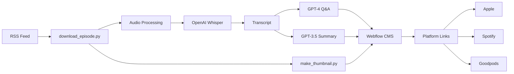

# Podcast Sync Automation Suite

A comprehensive automation suite for managing podcast web presence, powered by AI for content generation and multi-platform distribution.

[DIAGRAM PLACEHOLDER: High-level architecture showing the flow from RSS feed to Webflow CMS, including AI processing steps]



### Workflow Overview

The diagram above illustrates the automated pipeline:
1. New episodes are detected from the RSS feed
2. Audio is downloaded and processed in optimized chunks
3. OpenAI Whisper generates transcripts from the audio
4. GPT-4 creates Q&A content while GPT-3.5 generates summaries
5. Custom thumbnails are generated in parallel
6. All content is published to Webflow CMS
7. Platform-specific links are generated and validated

## Overview

This project automates the end-to-end process of managing a podcast's web presence by:
- Automatically syncing new episodes from RSS feeds to Webflow CMS
- Generating AI-powered transcripts and Q&A content
- Creating custom episode thumbnails
- Managing multi-platform distribution (Apple, Spotify, Goodpods)
- Supporting retroactive processing of existing episodes

## Requirements

- Python 3.9+ (3.11 recommended)
- FFmpeg for audio processing
- 16GB+ RAM recommended for large audio files
  - Required for processing high-quality audio files (up to 200MB)
  - Needed for Whisper's chunked audio processing (2GB per chunk)
  - Used for large GPT context windows (up to 4GB)
  - Handles parallel thumbnail generation and uploads
- GPU optional (can accelerate Whisper transcription)

### GPU Setup Notes
```python
# Check CUDA availability
import torch
print(f"CUDA available: {torch.cuda.is_available()}")
print(f"CUDA version: {torch.version.cuda}")

# Common CUDA/PyTorch version pairs:
# CUDA 11.8 → torch 2.0.0+cu118
# CUDA 12.1 → torch 2.1.0+cu121

# See compatibility matrix:
# https://pytorch.org/get-started/locally/
```

For optimal GPU performance with Whisper:
- Install CUDA Toolkit 11.8+ ([NVIDIA docs](https://developer.nvidia.com/cuda-downloads))
- Match PyTorch version to your CUDA version
- Monitor GPU memory usage (8GB+ recommended)

### Python Version Notes
- Python 3.8: Not supported (uses newer async features)
- Python 3.9-3.10: Fully supported
- Python 3.11+: Recommended (better performance)
- Python 3.12: Limited testing, may have compatibility issues

## Key Features

- **Automated Episode Processing**
  - RSS feed monitoring for new episodes
  - Audio file downloading and processing
  - Custom thumbnail generation
  - Platform link management (Apple, Spotify, Goodpods)

- **AI-Powered Content Generation**
  - Automated transcription using OpenAI Whisper
  - Q&A generation from transcripts using GPT-4
  - Episode summaries and excerpts
  - Intelligent episode categorization

- **Webflow CMS Integration**
  - Automated content publishing
  - Asset management
  - Category organization
  - Site-wide deployment controls

## Project Structure

```
.
├── src/
│   ├── ai/                    # AI-powered content generation
│   │   ├── transcribe_podcast.py
│   │   ├── create_excerpt.py
│   │   └── classifier.py
│   ├── media/                 # Media processing
│   │   ├── download_episode.py
│   │   └── make_thumbnail.py
│   ├── webflow/              # Webflow integration
│   │   ├── publisher.py
│   │   ├── categories.py
│   │   └── upload_asset.py
│   └── utils/                # Utility functions
│       ├── config.py
│       ├── text.py
│       └── convert_md_to_html.py
├── test/                     # Test suite
├── debug/                    # Debug outputs (gitignored)
├── assets/                   # Static assets for the application
│   ├── images/              # Image resources
│   │   └── default_episode_background.png
│   └── fonts/               # Font resources
│       ├── AbrilFatface-Regular.ttf
│       └── NotoSans-BoldItalic.ttf
├── config.yaml.example       # Configuration template
├── requirements.txt          # Python dependencies
└── README.md                # This file
```

## Installation & Setup

1. Clone the repository:
   ```bash
   git clone https://github.com/DorkLogic/podcast-sync
   cd podcast-sync
   ```

2. Create and activate a virtual environment:
   ```bash
   python -m venv venv
   source venv/bin/activate  # On Windows: venv\Scripts\activate
   ```

3. Install dependencies:
   ```bash
   pip install -r requirements.txt
   ```

4. Configure the application:
   ```bash
   cp config.yaml.example config.yaml
   # Edit config.yaml with your credentials and settings
   ```

### Dependencies & Version Constraints

Key dependencies and their version requirements:
- `openai>=1.3.5`: Required for latest API features
- `Pillow>=10.2.0`: For image processing
- `pydub>=0.25.1`: Audio processing (requires FFmpeg)
- Additional dependencies listed in `requirements.txt`

For GPU acceleration:
```bash
pip install torch torchvision torchaudio --index-url https://download.pytorch.org/whl/cu118
```

### Required API Keys & Credentials

You can provide credentials via environment variables or `config.yaml`. Environment variables take precedence.

Environment Variables:
```bash
# Required
export WEBFLOW_API_TOKEN="your_token"
export OPENAI_API_KEY="your_key"
export SPOTIFY_CLIENT_ID="your_id"
export SPOTIFY_CLIENT_SECRET="your_secret"

# Optional
export YOUTUBE_API_KEY="your_key"
export BUZZSPROUT_API_KEY="your_key"
```

### Configuration Override Behavior

Environment variables always override `config.yaml` values. For example:

```yaml
# config.yaml
webflow:
  api_token: "config_token"  # Will be overridden if WEBFLOW_API_TOKEN exists
  site_id: "site_123"        # No env var, this value will be used

openai:
  api_key: "config_key"      # Will be overridden if OPENAI_API_KEY exists
  model: "gpt-4"            # No env var, this value will be used
```

⚠️ **Warning**: While `config.yaml` is ignored by default in `.gitignore` to prevent accidental commits, it's still recommended to use environment variables for secrets. This provides an additional layer of security and follows best practices for credential management.

## Configuration

The `config.yaml` file manages all settings and credentials. Here's a complete reference:

### Required Configuration Keys
```yaml
webflow:
  api_token: "YOUR_WEBFLOW_API_TOKEN"  # or use WEBFLOW_API_TOKEN env var
  episode_collection_id: "required"
  site_id: "required"

openai:
  api_key: "YOUR_OPENAI_API_KEY"  # or use OPENAI_API_KEY env var
  model: "gpt-4-1106-preview"  # or "gpt-3.5-turbo" for lower cost

rss:
  feed_url: "required"

hosts:
  host1:
    name: "required"
    short_name: "required"
  host2:
    name: "required"
    short_name: "required"
```

### Optional Configuration Keys
```yaml
spotify:
  client_id: "optional"
  client_secret: "optional"
  show_id: "optional"

youtube:
  api_key: "optional"
  channel_id: "optional"

schedule:
  interval_minutes: 60
  timezone_offset: 0

# See config.yaml.example for full reference
```

### AI Model Configuration

Cost considerations for OpenAI models:
- GPT-4 (default): Higher quality, higher cost (~$0.01/episode)
  - Default model: `gpt-4-1106-preview` (latest as of 2024)
  - Alternative: `gpt-4` (smaller context, lower cost)
  - Check access: `openai api models list | grep gpt-4`
- GPT-3.5: Lower quality, ~10x cheaper
  - Default: `gpt-3.5-turbo-1106`
  - Legacy: `gpt-3.5-turbo`
- Whisper: Fixed cost per audio minute
  - Default: `whisper-1` (only version available)

To switch models, modify in config.yaml:
```yaml
openai:
  model: "gpt-3.5-turbo-1106"  # Instead of "gpt-4-1106-preview"
```

## Usage Instructions

### Common Flags (All Scripts)
The following flags work with all main scripts:
```bash
--debug        Enable debug logging
--verbose      Increase log verbosity
--dry-run      Show what would be done
--config PATH  Use alternative config file
```

### Processing New Episodes

Run the main sync script:
```bash
python src/podcast_sync.py [options]

Options:
  --debug        Enable debug logging
  --verbose      Increase log verbosity
  --force        Force reprocess existing episodes
  --retry N      Retry failed operations N times
  --dry-run      Show what would be done without doing it
```

### Retroactive Processing

Process existing episodes:
```bash
python src/podcast_retro_sync.py [options]

Options:
  --start-date YYYY-MM-DD    Process from date
  --end-date YYYY-MM-DD      Process until date
  --batch-size N             Process N episodes at once (default: 5)
  --skip-existing            Skip episodes with transcripts
  --force                    Reprocess even if exists
  --retry N                  Retry failed operations
```

### Scheduling & Automation

Example cron job for regular syncing:
```bash
# Check for new episodes every 6 hours
0 */6 * * * cd /path/to/podcast-sync && source venv/bin/activate && python src/podcast_sync.py --retry 3

# Daily cleanup of old debug files (keep last 7 days)
0 0 * * * find /path/to/podcast-sync/debug -type f -mtime +7 -delete
```

Windows Task Scheduler example:
```powershell
# Create scheduled task (runs every 6 hours)
$action = New-ScheduledTaskAction -Execute 'C:\podcast-sync\venv\Scripts\python.exe' -Argument 'C:\podcast-sync\src\podcast_sync.py --retry 3'
$trigger = New-ScheduledTaskTrigger -Once -At (Get-Date) -RepetitionInterval (New-TimeSpan -Hours 6)
Register-ScheduledTask -Action $action -Trigger $trigger -TaskName "PodcastSync" -Description "Sync new podcast episodes"
```

### Performance Optimization

The suite uses several strategies to handle large files efficiently:

1. **Chunked Audio Processing**
   - Large audio files are processed in 25MB chunks
   - Each chunk uses ~2GB RAM during transcription
   - Parallel processing when GPU available

2. **Memory Management**
   ```python
   # Example configuration for large files
   whisper_config:
     chunk_size: 25  # MB
     batch_size: 8   # GPU only
     max_retries: 3
   ```

3. **Resource Monitoring**
   - Use `--debug` flag to see memory usage
   - Check `debug/performance_log.txt` for metrics
   - GPU memory stats in `debug/gpu_usage.log`

## Error Handling & Troubleshooting

Common errors and solutions:

1. **Missing API Keys**
   ```
   Error: OPENAI_API_KEY not found
   ```
   - Check environment variables
   - Verify config.yaml permissions and format

2. **Invalid RSS Feed**
   ```
   Error: Failed to parse RSS feed
   ```
   - Verify feed URL in config.yaml
   - Check internet connection
   - Inspect debug/debug_rss.txt for feed content

3. **Webflow Publish Failures**
   ```
   Error: Failed to publish to Webflow
   ```
   - Check API token permissions
   - Verify collection IDs
   - See debug/webflow_error.log for details

### Logging

Logs are stored in:
- `debug/debug_log.txt`: Main application log
- `debug/webflow_error.log`: Webflow-specific errors
- `debug/openai_usage.log`: API usage and costs

Increase logging detail:
```bash
python src/podcast_sync.py --debug --verbose
```

## Testing

Run all tests:
```bash
pytest test/
```

Run specific test categories:
```bash
pytest test/test_webflow.py  # Webflow integration tests
pytest test/test_ai/         # AI service tests
pytest -k "transcribe"       # Run tests matching "transcribe"
```

Generate coverage report:
```bash
pytest --cov=src/ test/
```

### CI/CD Testing
- GitHub Actions workflows in `.github/workflows/`
- Automated tests run on pull requests
- Coverage reports posted to PRs

## License

This project is licensed under the MIT License - see below for details:

```
MIT License

Copyright (c) 2024 [Your Name/Organization]

Permission is hereby granted, free of charge, to any person obtaining a copy
of this software and associated documentation files (the "Software"), to deal
in the Software without restriction, including without limitation the rights
to use, copy, modify, merge, publish, distribute, sublicense, and/or sell
copies of the Software, and to permit persons to whom the Software is
furnished to do so, subject to the following conditions:

The above copyright notice and this permission notice shall be included in all
copies or substantial portions of the Software.

THE SOFTWARE IS PROVIDED "AS IS", WITHOUT WARRANTY OF ANY KIND, EXPRESS OR
IMPLIED, INCLUDING BUT NOT LIMITED TO THE WARRANTIES OF MERCHANTABILITY,
FITNESS FOR A PARTICULAR PURPOSE AND NONINFRINGEMENT. IN NO EVENT SHALL THE
AUTHORS OR COPYRIGHT HOLDERS BE LIABLE FOR ANY CLAIM, DAMAGES OR OTHER
LIABILITY, WHETHER IN AN ACTION OF CONTRACT, TORT OR OTHERWISE, ARISING FROM,
OUT OF OR IN CONNECTION WITH THE SOFTWARE OR THE USE OR OTHER DEALINGS IN THE
SOFTWARE.
```

## Assets

The `assets/` directory contains essential resources used by the application:

### Images
- `images/default_episode_background.png`: Default background image used for generating episode thumbnails
  - Used by the thumbnail generation system
  - Required for creating episode artwork
  - Resolution and format must be maintained for consistent output

### Fonts
- `fonts/AbrilFatface-Regular.ttf`: Primary font for episode numbers in thumbnails
- `fonts/NotoSans-BoldItalic.ttf`: Supporting font for additional text elements

These assets are critical for:
- Thumbnail generation for episodes
- Maintaining consistent branding across episodes
- Ensuring visual quality in the podcast's web presence

⚠️ **Note**: Do not delete or modify these assets as they are required for proper functioning of the thumbnail generation system.
